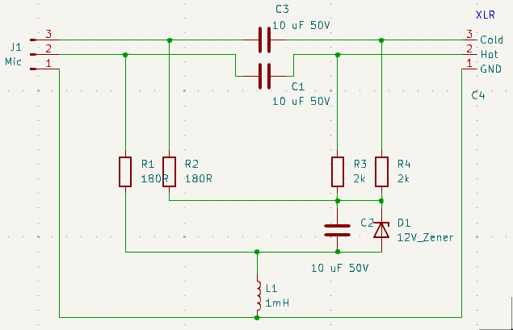
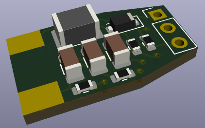
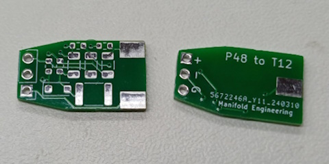
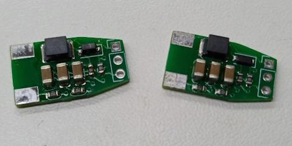
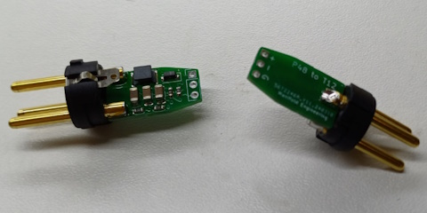
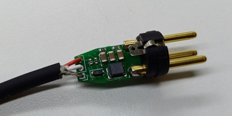
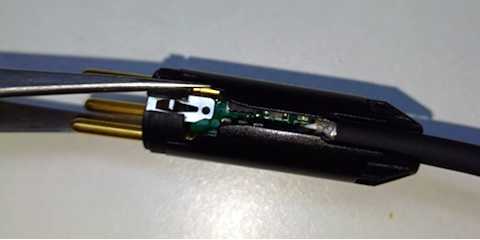
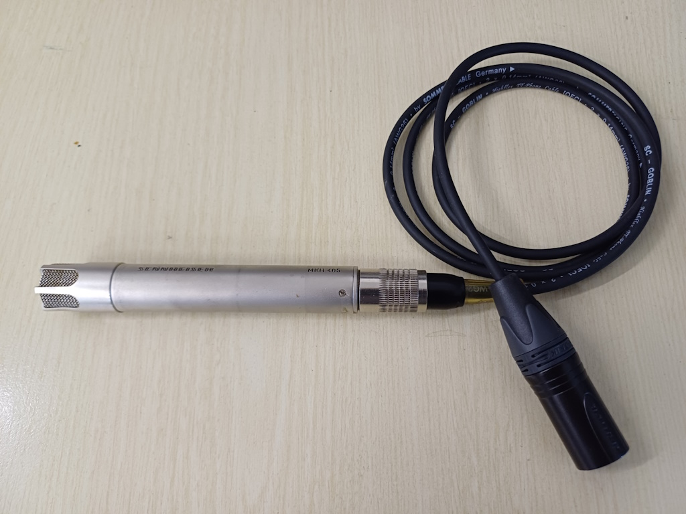

# Pat-Mat
**Phantom And Tonader - Microphone Adapter Thing**

World of professional audio has moved to phantom power for condenser microphones decades ago. But there are good microphones from older days out that used other standards - most notably tonader power (also called T12, T-Power or AB power). Pat-Mat (Phantom And Tonader - Microphone Adapter Thing) is a professional-grade adapter designed to convert standard 48V phantom power into 12V tonader power.

Pat-Mat consists of single PCB designed to fit inside standard XLR male connector (output connctor, like Neutrik NC3MXX series), allows for fit for standard cable relief. Users may choose cable and microphone connector for their specific microphones (DIN, Tuchel...).

## Hardware design

Hardware design is meant be as simple as possible.

12V is prepared by voltage divider resistors (R3, R4) to Zener diode. Audio signal is by connected through C1 and C3 capacitors.

All schematics and PCB design files are available in the `/pat-mat-pcb` directory in KiCAD 8 format. There is output folder with gerber file outputs for manufacturing. They were successfully manufactured by JLC-PCB. Simple BOM file with links to TME is provided. Since Pat-Mat design is simple and only need standard components, it should be possible to source parts from your favourite supplier.

**In order to fit to standard XLR connector, order you PCB 1.2 mm thick. 1.6 mm wont fit!**

## Assembly

*(note: This is development version, + and G pins are flipped. It is fixed in published version.)*

First populate SMD components onto PCB (or preferably order assmebled PCBs)

Then solder PCB into XLR pins

Then add cable of your choice. You mich have to trim some strands of shielding to fit into PCB. You might have to let shorter loose wires than you would do whe soldering standard connector.

Add cable relief

And finish cable like you would the standard way. 

## License

This project is open-source under the MIT License—feel free to use, modify, and improve Pat-Mat for your own audio needs.

---

**"A Je To!"**